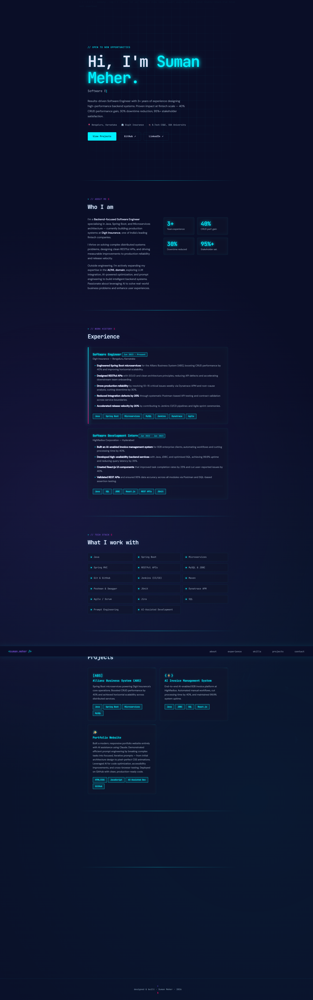
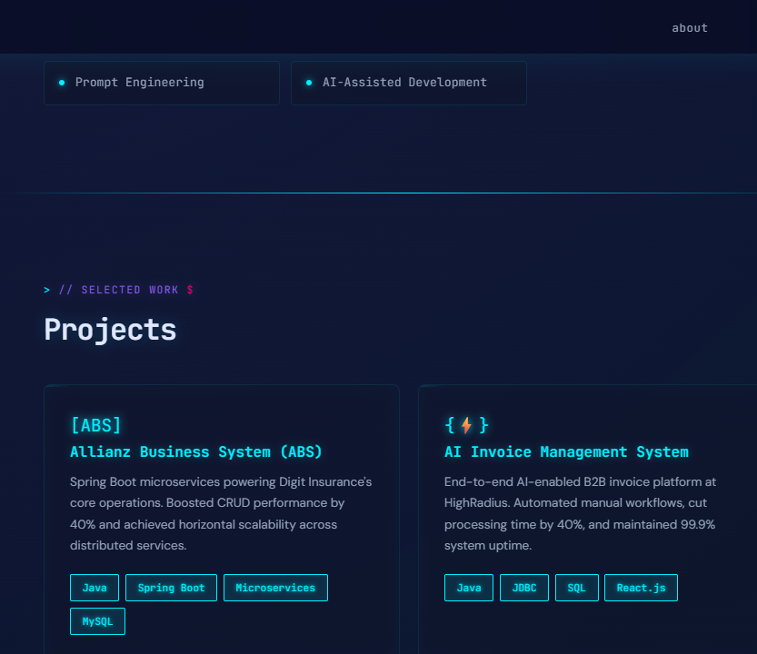
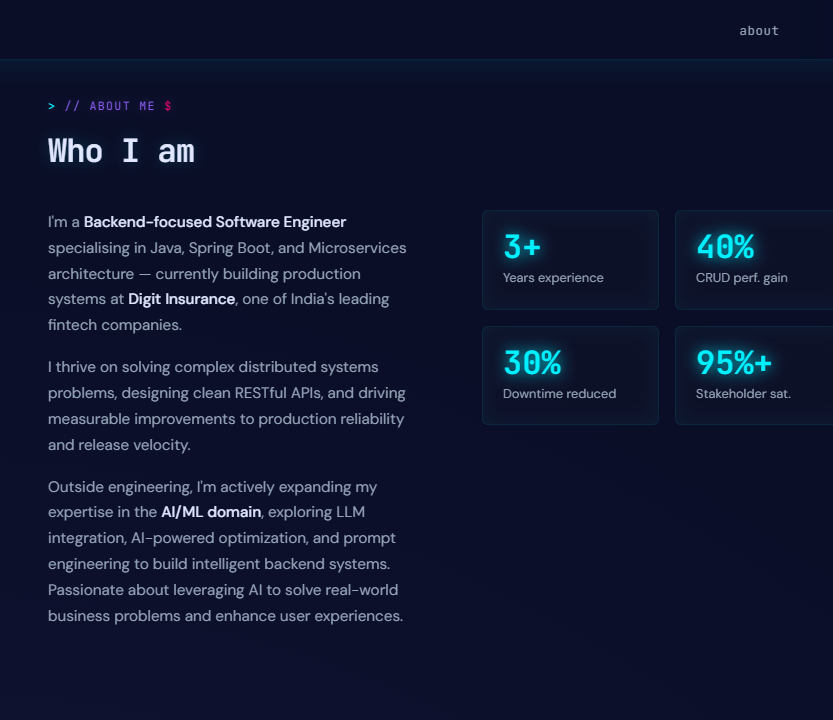
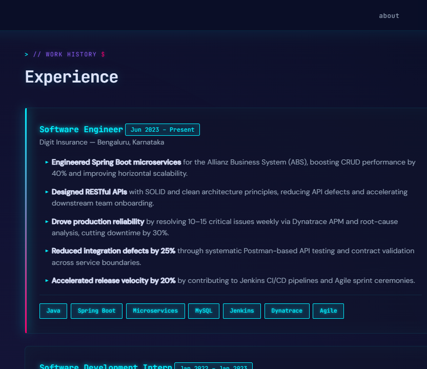
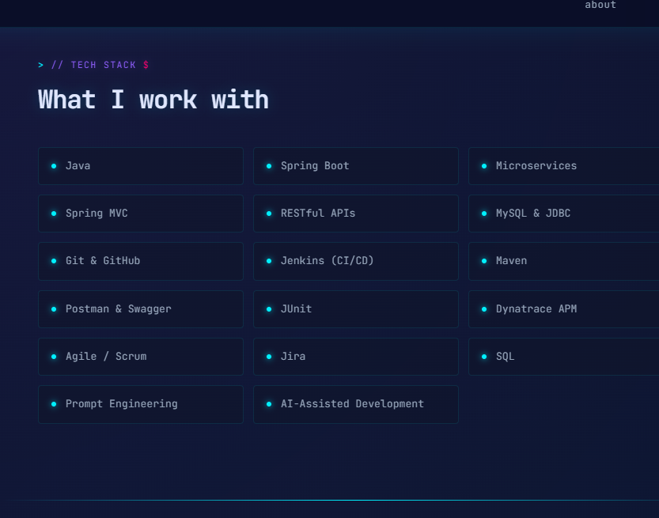
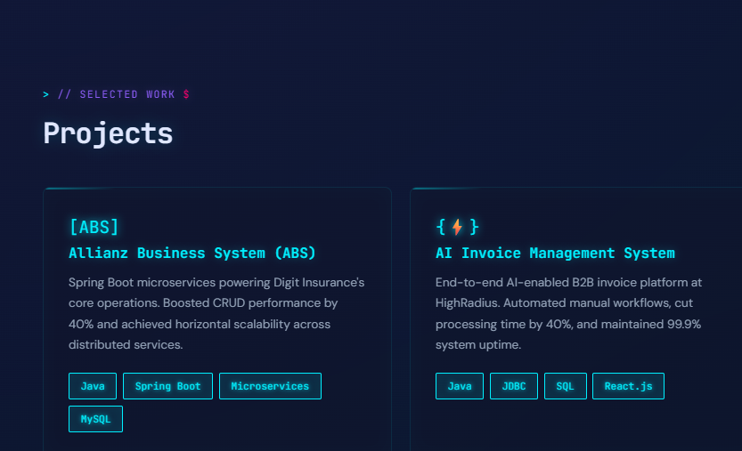
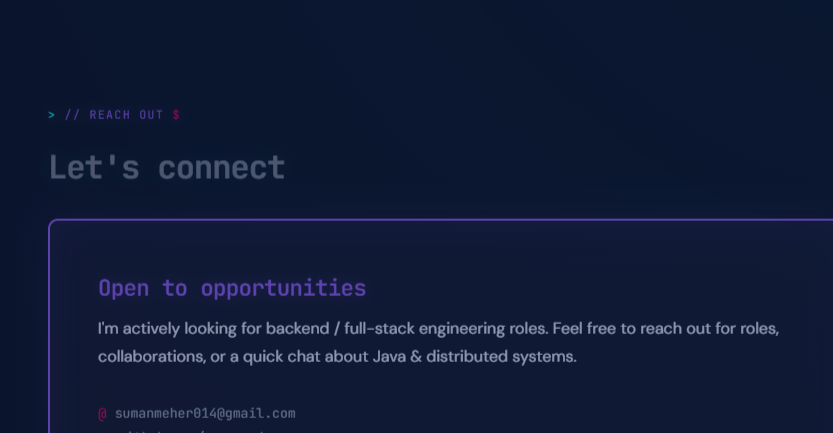

# Portfolio App

A personal portfolio website built with modern frontend tooling and AI-assisted development.

## Overview

This project is a responsive portfolio landing page that showcases experience, projects, skills, certifications, and contact information. It was developed using HTML, CSS, and JavaScript, with a focus on clean design, animations, and fast iteration.

## Tech Stack

- Vite
- React
- TypeScript
- HTML / CSS

## Features

- Responsive layout for desktop and mobile
- Hero section with animated typewriter text
- Revealing scroll animations
- Project showcase and skills section
- Contact area with working links

## Getting Started

### Install dependencies

```bash
npm install
```

### Run locally

```bash
npm run dev
```

Then open the local URL shown in the terminal to preview the site.

### Build for production

```bash
npm run build
```

## Screenshots

### Front Page



### Hero Section



### About Section



### Experience Section



### Skills Section



### Projects Section



### Contact Section



## Notes

- The project was built efficiently with AI assistance and prompt-driven iteration.
- Screenshots of the landing page and key sections are included for quick preview.

## Author

Suman Meher

## Contact

- Email: sumanmeher014@gmail.com
- GitHub: https://github.com/sumanmeher
- LinkedIn: https://www.linkedin.com/in/suman-meher-91a6491b0/
